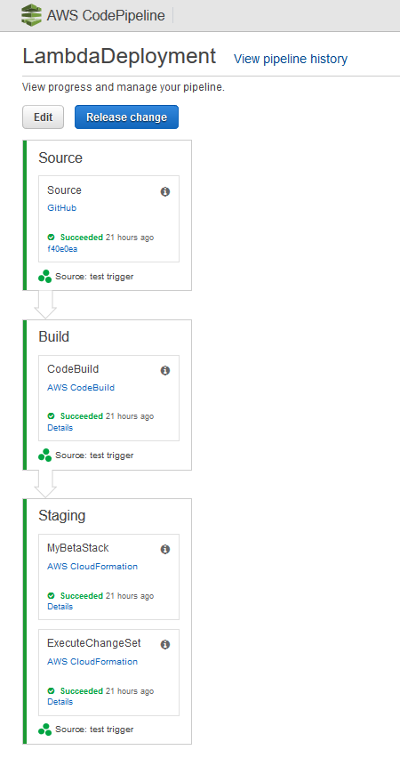

# alert-lambda

## Description

This is a test project to create a pipeline in aws for lambda deployment.

Based on AWS tutorial [Building a Pipeline for Your Serverless Application](https://docs.aws.amazon.com/lambda/latest/dg/build-pipeline.html)

## Build and Delpoy

Lambda is build by AWS CodeBuild. See `buildspec.yml` for build details
Serverless resources are described with the help of SAM notation. See `samTemplate.yml`

## Pipeline

The output pipeline is triggered by push into this repository and looks like this:

